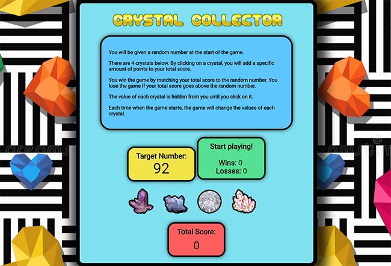

# jQuery "Crystal Collector" Game

 [View Live!](https://bereznd1.github.io/week-4-game/) 

## Brief Description

The **jQuery "Crystal Collector" Game** allows users to click on a crystal image of their choice (out of 4 possible options). Each crystal is worth a different amount of points but that amount is undisclosed until the crystal is clicked. Upon clicking on a crystal, that crystal's point value is added to the user's total score, which is displayed on screen. If their total score matches the random target number that was generated when the game was first loaded, a win is recorded on screen and the game is reset for another play. If their total score goes above the random target number, a loss is recorded on screen, and the game is reset as well. 

## How This Was Achieved

First, I set up global variables to track the number of **wins**, **losses**, & **current points**, and to set up an empty variable that will store the **random target number** that gets picked at the beginning of each game.

I then created an **initialize** function, which sets the **current points** to 0 & places that number into the current points div within the DOM, generates a **random target number** (between 19-120) that will need to be reached by the user & places it into the DOM as well, updates the DOM with the number of **wins** & **losses**, and finally, sets the *value* of each crystal on the page to a different **random number** (between 1-12). This **initialize** function then gets called to start off the game as soon as the page has loaded. 

Next, I attached a jQuery click event to all the buttons at once by using their class selector, and wrote a function which gets the *value* attribute from the particular crystal that was clicked, converts it into an integer, and then adds that integer to the **current points** that the user has. This total then gets displayed in the DOM in the appropriate location.

Within that same function, I wrote some code using **if** & **if-else** statements that is activated upon a win or a loss. If the user's **current point amount** is equal to the **random target number**, this is considered a win, and 1 point is added to the **wins** variable. The DOM is updated with text saying *You won!*, & the **initialize** function is then called to restart the game.

If the user's **current point amount** is greater than the **random target number**, this is considereed a loss, and 1 point is added to the **losses** variable. The DOM is updated with text saying *You lost!*, & the **initialize** function is called once again in order for the game to restart. 